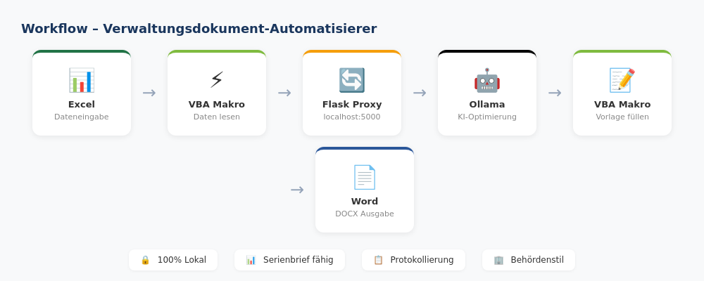
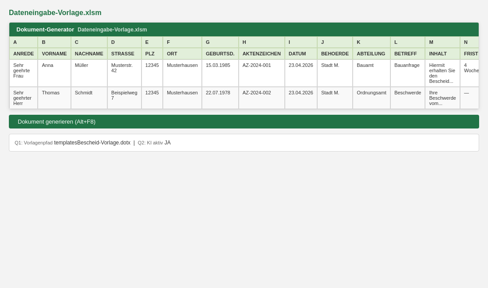
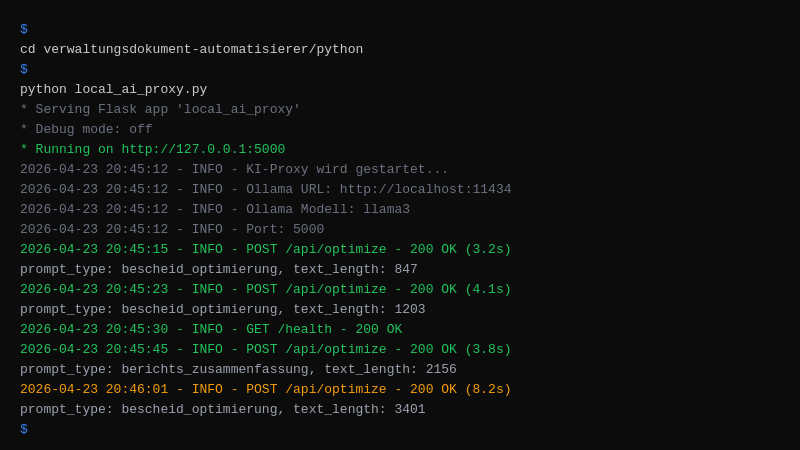
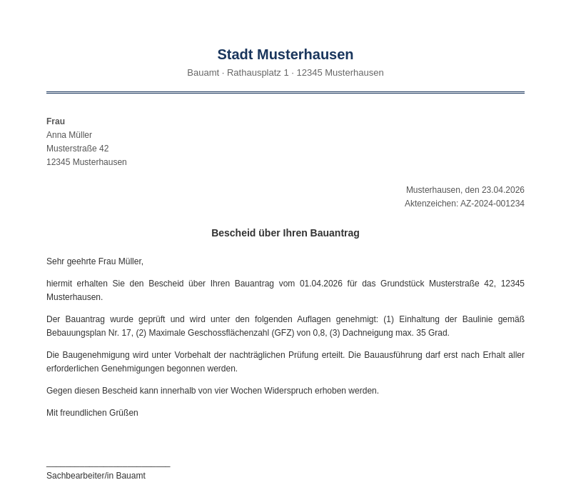

# Verwaltungsdokument Automatisierer

<p align="center">

</p>

    

> Automatisierung der Verwaltungsdokumenterstellung für Behörden

## Overview

VBA-Makros und Python-Scripte zur Automatisierung von Verwaltungsdokumenten. Excel-Vorlagen, Word-Dokumente und KI-gestützte Texterstellung. Modular und erweiterbar.

## Features

- VBA-Makros für Excel und Word
- Python KI-Proxy für Texterstellung
- Modulare Vorlagen-Struktur
- Konfigurierbare Dokument-Typen
- Batch-Verarbeitung
- Einfache Anpassung

## Tech Stack

| Tech | Zweck |
|------|-------|
| VBA | Office-Automatisierung |
| Python | KI-Proxy & Tools |
| Ollama | Lokale KI |
| Office 2016+ | Zielplattform |

## Quick Start

```bash
# VBA-Makros in Excel/Word importieren
# Python KI-Proxy:
cd python && pip install -r requirements.txt
python proxy.py
```

## Screenshots

**Workflow-Übersicht**



**Excel-Vorlage**



**KI-Proxy Konfiguration**



**Word-Dokument-Output**



---

## Contributing

Beiträge sind willkommen! Bitte erstelle einen Issue oder Pull Request.

## License

MIT License — siehe [LICENSE](LICENSE).

<p align="center">
<a href="https://github.com/ceeceeceecee">ColeTrading</a> &bull; DSGVO-konform &bull; Self-Hosted &bull; Open Source
</p>